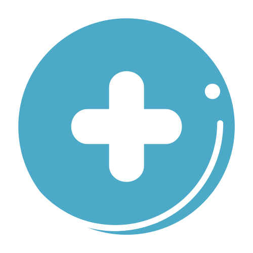

  

  # 🩺 SAMED  
  ### Sistema de Assistência Médica Digital
  
“Tecnologia a serviço da vida.”

---

## 📘 Sobre o Projeto
O **SAMED** é um projeto acadêmico desenvolvido com o objetivo de criar uma solução tecnológica voltada à **gestão e acesso rápido de informações médicas**.  

A proposta é permitir que **usuários cadastrem seus dados médicos e de dependentes** (como crianças e idosos), vinculando essas informações a **pulseiras inteligentes com tecnologia NFC**. Assim, em situações de emergência, **profissionais de saúde podem acessar os dados vitais do paciente por aproximação**, garantindo um atendimento mais ágil e seguro.
Alguns smartwatchs fornecem tecnologia similar, porém não são acessíveis para toda população, devido ao valor e necessidade de que seu usuário saiba como usá-lo, por isso criamos uma forma mais acessível e prática.

---

## 🎯 Objetivo
Centralizar e disponibilizar informações médicas essenciais de forma **rápida, segura e acessível**, contribuindo para a **eficiência e humanização do atendimento de emergência**.

---

## 💡 Funcionalidades Principais
- Cadastro de usuários e dependentes;  
- Registro de tipo sanguíneo, alergias, doenças crônicas e medicamentos;  
- Integração com pulseira NFC para leitura por aproximação;  
- Acesso rápido por profissionais de saúde;  
- Assistente virtual **SAM**, um robô amigável que orienta o usuário dentro do sistema.  

---

## 🚑 Contexto e Problema
Durante a fase de pesquisa, foram **consultadas enfermeiras de hospitais locais**, que relataram as dificuldades enfrentadas em atendimentos de emergência, especialmente quando pacientes estão desacordados ou sem histórico médico disponível.  

O **SAMED** busca solucionar esses problemas, oferecendo uma ferramenta que **centraliza informações vitais e salva vidas**.

---

## 🧠 Tecnologias (em desenvolvimento)
- **Front-end:** HTML, CSS e JavaScript  
- **Back-end (planejado):** PHP e MySQL  
- **Futuro:** Aplicativo mobile, integração com pulseiras NFC e Assistente virtual com IA.

---

## 👩‍💻 Equipe
Projeto desenvolvido por Julia Barbosa, Amábile Silvério, Gustavo Marques e Caike Muramoto, alunos do curso de **Desenvolvimento de Software Multiplataforma (DSM)** da **Fatec Itapira**, sob orientação dos professores: Ana Celia Portes e Junior Gonçalves.

> 🚧 **Status do projeto:** Em desenvolvimento.

---

  
  
<b>SAMED - Sistema de Assistência Médica Digital</b> 
  “Cuidando de quem você ama, mesmo quando você não pode falar.”

